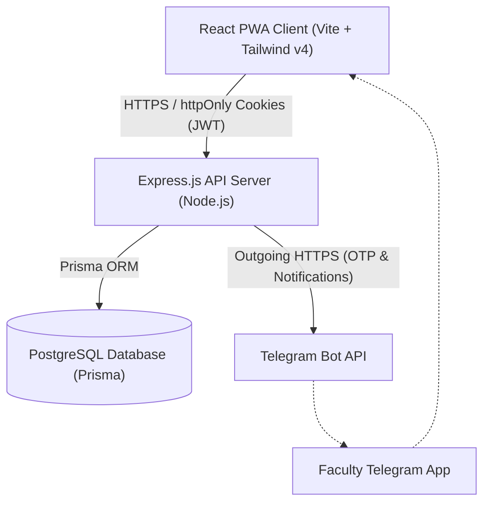
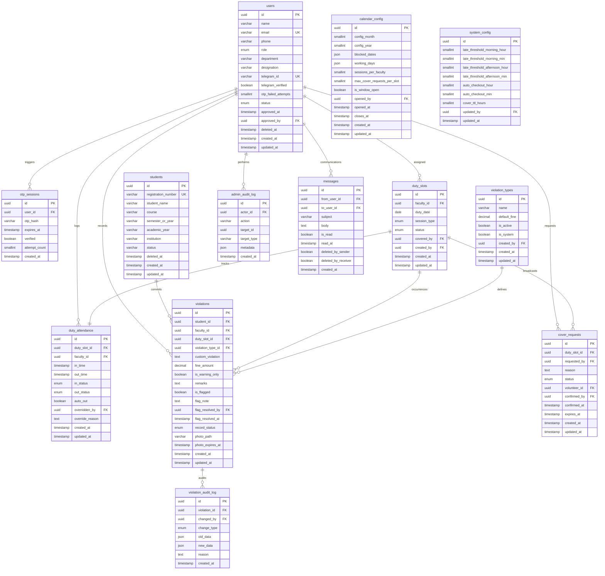
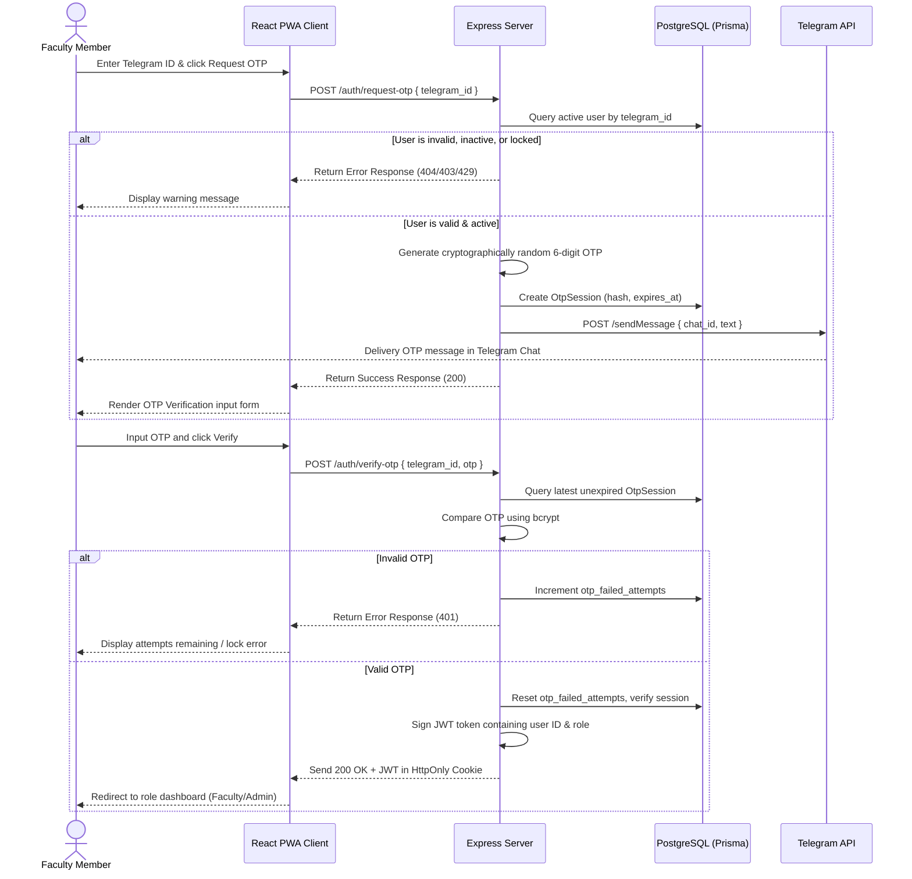
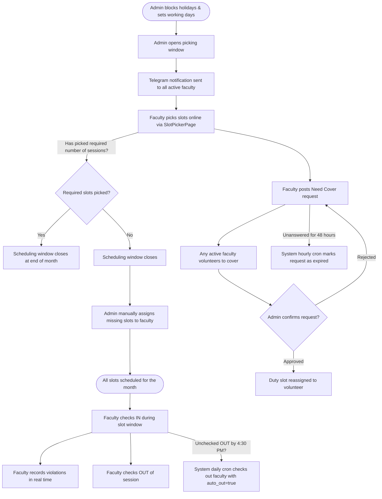

# SIMS Discipline Management System (SIMS DMS) — Project Overview

The SIMS Discipline Management System (SIMS DMS) is a web-based mobile-first PWA application built for the **SIMS College of Pharmacy** (managing ~20–30 faculty members) to replace a manual, paper-based system. It digitizes scheduling discipline duties, monitoring attendance (In/Out checks), and logging/auditing student violations on campus.

This overview provides a thorough analysis of the repository from three key perspectives: **Software Architect**, **Software Developer**, and **Product Manager**.

---

## System Diagrams

### 1. High-Level System Architecture


---

### 2. Database Schema (Prisma ERD)


---

### 3. Sequence: Telegram OTP Authentication


---

### 4. Workflow: Scheduling & Need Cover Request Lifecycle


---

## 1. Software Architect Perspective

### Architecture & System Design
- **Monolithic Architecture**: Both the Express API backend and built static React assets are deployed together on **Railway**, maintaining a single deployment unit and simplifying network topology.
- **Data Query Synchronization**: Employs **TanStack React Query** with a default `staleTime` of 30 seconds and automatic polling intervals to ensure UI dashboard updates are real-time, removing complex infrastructural overheads like WebSockets or Server-Sent Events (SSE).
- **Service Worker integration**: Built using **VitePWA** (Workbox) configuration which registers an auto-updating service worker to precache only static build assets (HTML, CSS, JS, fonts, images). **API responses are intentionally never cached** — auth cookies, user data, violations, attendance, messages, and report data are sensitive and must always be fetched from the network to prevent stale or leaked data on shared devices.

### Security Implementation
- **httpOnly Cookies**: Authentication JSON Web Tokens (JWT) are strictly stored in `httpOnly` secure cookies. They are never written to `localStorage` or `sessionStorage`, securing the application against Cross-Site Scripting (XSS) token theft.
- **CSP & Helmet**: Employs Express Helmet with a tight Content Security Policy (CSP) tailored for Vite modules, Tailwind inline styles, and dynamic asset structures.
- **Rate Limiting**: Utilizes `express-rate-limit` globally and specifically targets login OTP validation.
- **Audit Trails**: Integrates two separate audit layers:
  - `violation_audit_log` (immutable tracking for student violation corrections/edits).
  - `admin_audit_log` (tracks administrative actions like session resets, settings updates, and soft deletes).

### Data Integrity Rules
- **No Sequential IDs**: Every primary key throughout all 15 schemas uses UUIDs (`@default(uuid())`), preventing enumeration attacks.
- **Soft Deletes**: Deletions are mapped as soft-deletes using the `deleted_at` field (except for Super Admin hard delete).
- **Exact Monetary Values**: Fines and financial figures are stored as `Decimal(8, 2)` instead of float, preventing rounding errors.

---

## 2. Software Developer Perspective

### Codebase Organization
The repository has a clean, decoupled monorepo structure:
- `/prisma`: Contains `schema.prisma` and database migrations.
- `/server`: Contains backend routing, controllers, middlewares, services, and script configurations.
- `/client`: React frontend compiled with Vite.
- `/specs`: Living documentation containing feature plans and checklist specs.

### Backend Design Patterns
- **Zod Validation Middleware**: Uses schemas (`server/schemas`) mapped to routes to guarantee request payload type safety and size restrictions before controllers execute.
- **MVC Architecture**: Routes bind controllers that execute logic, invoke Prisma query clients, log actions using Winston (`server/lib/logger`), and respond in a standardized JSON error envelope:
  ```json
  { "error": true, "code": "ERROR_CODE", "message": "Human-readable message" }
  ```

### Frontend Structure & Optimizations
- **Consolidated Tailwind CSS**: Consolidates layout styling into Tailwind CSS v4 utility classes and inline styles where dynamic variables (safe-area spacing, dynamic color configurations) are required, preventing competing CSS variables.
- **Protected Routes**: Utilizes the `ProtectedRoute` component enforcing strict role-based access:
  - Admin/Super Admin pages: `requiredRoles={['admin', 'super_admin']}`
  - Super Admin audit logs: `requiredRoles={['super_admin']}`
  - Faculty pages: `requiredRoles={['faculty']}` — Admin users cannot access faculty-only pages.

---

## 3. Product Manager Perspective

### Business Goals & Persona Alignment
The product aims to optimize operations for SIMS College of Pharmacy by substituting manual worksheets with a responsive dashboard tailored for three roles:

| Role | Core User Flow | Core Responsibilities |
|---|---|---|
| **Super Admin** | Admin management, system audits, server configuration | Manages admin accounts, updates system configs, clears locked login sessions |
| **Admin** | Student Excel ingestion, scheduling window controls, override approvals | Opens picking window, reviews attendance overrides, resolves flagged violations, exports reports |
| **Faculty** | Slot picking, checking In/Out, registering student violations | Schedules own monthly duties, checks in, logs infractions, requests coverage swap |

### Product Usability Features
- **OTP Lockout Safety**: If a faculty member reaches 5 failed OTP attempts, their account is locked. This secures credentials but is easily reset by a Super Admin via the user interface.
- **Need Cover Swapping**: Converts direct faculty rescheduling into a broadcast system. Faculty broadcast a request, another faculty member volunteers, and Admin confirms—saving hours of direct back-and-forth negotiation.
- **Late Check-In Flagging**: System monitors check-ins against config parameters (`late_threshold_morning_hour` etc.) and auto-clocks out faculty at 4:30 PM (or as configured) if checkout is forgotten.
- **Text-Only Violations**: Phase 1 skips image storage to avoid slow network uploads and high hosting costs on Railway, keeping the focus on fast text recording.

---

## Actionable Insights & Future Recommendations

1. **Required Production Environment Variables**:
   Set all variables from `.env.example` in Railway → Variables. Critical ones:
   - `TZ=Asia/Kolkata` — required for correct cron scheduling (auto clock-out, calendar auto-close) and IST date comparisons in attendance.
   - `CORS_ORIGIN` — must match your deployed frontend URL exactly (no trailing slash).
   - `JWT_SECRET` — use a 64+ hex character random string. Never reuse across environments.
   - `TELEGRAM_WEBHOOK_SECRET` — register this with Telegram when setting the webhook URL.
   - `APP_URL` — public URL of the deployed application.

2. **Authentication — httpOnly Cookie, Not localStorage**:
   After successful OTP verification the server sets a `sims_token` httpOnly cookie and a `sims_csrf` non-httpOnly cookie. The JWT is **never** placed in `localStorage` or `sessionStorage`. Any tool or script that tries to read a token from `localStorage` will find nothing.

3. **Telegram OTP Login Flow**:
   - User enters their **numeric Telegram User ID** (not `@username`) on the login page.
   - Server looks up the user by `telegram_id`, sends a 6-digit OTP via the Telegram bot.
   - User pastes the OTP on the verification screen.
   - Valid OTP sets the httpOnly `sims_token` and CSRF cookies and redirects to the dashboard.

4. **Recommended Account Creation (Invite Flow)**:
   Create users via Admin → Users → Create User **without** supplying a Telegram ID. The system generates a 7-day invite link (`https://t.me/BOT?start=invite_TOKEN`). Share this link with the new faculty member — when they start the bot, their Telegram account is linked and their status changes to `active`. Only then can they request an OTP and log in.

5. **CSRF Protection**:
   All authenticated POST/PUT/PATCH/DELETE requests require an `X-CSRF-Token` header matching the `sims_csrf` cookie. The Axios client reads this cookie automatically and attaches the header. Scripts or curl commands that use httpOnly cookie auth must also forward this token.

6. **Phase 2 Photo Upload Foundation**:
   Columns `photo_path` and `photo_expires_at` exist in the database, but endpoints return `501 NOT IMPLEMENTED`. As the app shifts to Phase 2, a secure presigned URL strategy (e.g., AWS S3 or Supabase Storage) should be implemented to support temporary attachment access while maintaining strict privacy boundaries.
